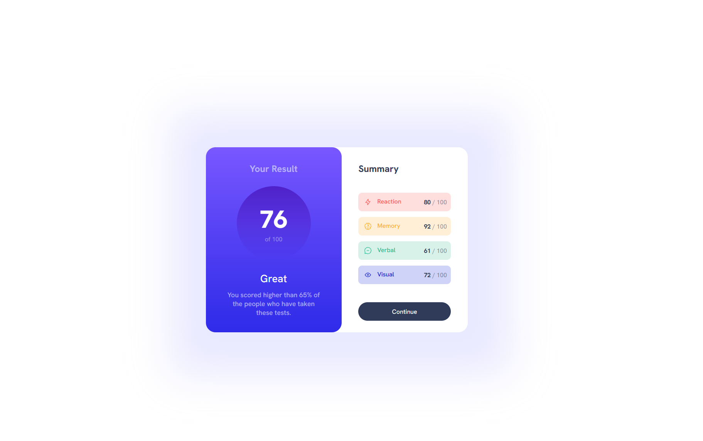
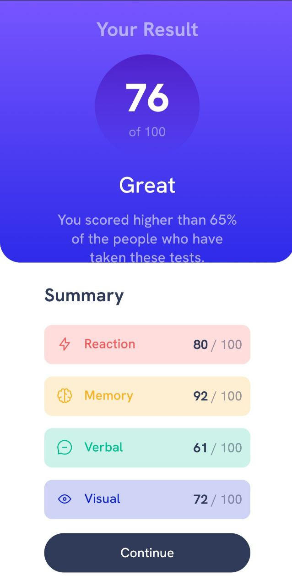

# 😶‍🌫️ Results Summary Component - Page Solution

This is my first solution to the [Results summary component challenge on Frontend Mentor](https://www.frontendmentor.io/challenges/results-summary-component-CE_K6s0maV) and took me 6 hours to complete. Frontend Mentor challenges help you improve your coding skills by building realistic projects. If you are a beginner you really need to try this!

## 🪞 Screenshots

## 🎥 Live WebSite

- [Live site URL](https://alexandru-ghergu.github.io/results-summary-component-main/)

## 🪄 Technologies

- `HTML5`
- `CSS`
- `Flexbox`

## 🎢 What I learned

- How z-index works.
- How to remove the background color from the borders of the body if there is a container with borders and shadow.
- How VW and VH works.
- How child works.
- Better use of the relative units.
